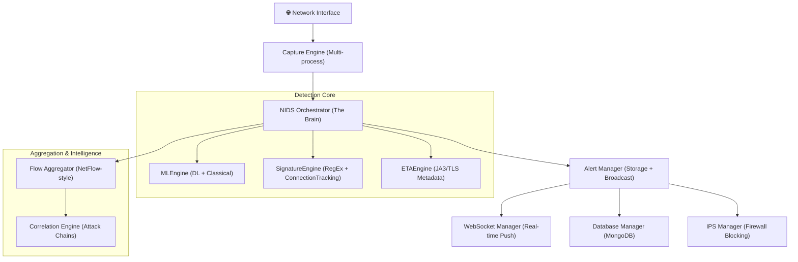

# 🏗️ Ghost Operators NIDS — Backend Deep Dive

The backend is built using **FastAPI** and follow a **Modular Orchestrator Pattern**. It is designed for high performance, real-time response, and enterprise-grade security.

---

## 1. High-Level Architecture

---

## 2. Component Breakdown

### 🧠 NIDS Orchestrator (`orchestrator.py`)
The "Central Nervous System." It manages the lifecycle of all other engines.
- **Packet Pipeline**: Receives raw packets from the Capture Engine and distributes them to detection engines.
- **Async Execution**: Handles packet processing, flow aggregation, and background cleanup without blocking the main API thread.
- **State Management**: Tracks system-wide metrics (PPS, alerts generated, CPU/RAM).

### 📡 Capture Engine (`capture_engine.py`)
- **Engine**: Uses **Scapy** (with Npcap/libpcap) for deep dissection. 
- **Mode**: Supports both **Active Sniffing** (Wi-Fi/Ethernet) and **PCAP Replay**.
- **Ring Buffer**: Implements an in-memory packet buffer to prevent packet loss during high-load bursts.

### 🛡️ Detection Engines
- **MLEngine**:
    - **Classical**: Random Forest and Isolation Forest (for anomaly detection).
    - **Deep Learning**: PyTorch-based 1D-CNN (for pattern recognition) and LSTM (for temporal/sequential analysis).
    - **Ensemble**: Votes across different models to reduce False Positives.
- **SignatureEngine**:
    - **Stateful Tracking**: Tracks connections (SYN-ACK-FIN) to detect DDoS, Port Scans, and Brute Force.
    - **Rules**: Suricata-compatible parser for community rule sets.
- **ETAEngine**: 
    - Analyzes **JA3/JA3S fingerprints** to identify malware even if the traffic is encrypted (no decryption needed).

### 📊 Flow Aggregator (`flow_aggregator.py`)
Instead of looking at single packets, it groups them into **Bidirectional Flows**.
- **Context**: Tracks duration, byte counts, and inter-arrival times.
- **Flow-level ML**: Allows for detecting complex command-and-control (C2) patterns that packet-level inspection might miss.

### 🚨 Alert & Incident Management
- **AlertManager**: Handlers deduplication and deduplication. If 1,000 identical packets hit, it generates 1 alert with a "Count: 1000" instead of 1,000 separate alerts.
- **CorrelationEngine**: Maps alerts to the **MITRE ATT&CK** framework. It groups related alerts from the same Source IP into a "Security Incident."

### ⛓️ Security & Auth (`security.py` / `auth.py`)
- **JWT + Refresh Tokens**: Enterprise-standard session management.
- **RBAC**: Role-Based Access Control (Admin, Analyst, Viewer).
- **Hardened API**: Rate limiting, brute-force protection, and secure header injection.

---

## 3. The Lifecycle of a Packet

1.  **Capture**: CaptureEngine pulls packet from the NIC (Network Interface Card).
2.  **Dissection**: Scapy parses headers (IP, TCP, UDP, etc.).
3.  **Check-In**: Orchestrator sends packet to `FlowAggregator`.
4.  **Parallel Detection**:
    - ML Engine checks for anomalies.
    - Signature Engine checks for known exploit patterns.
    - ETA Engine checks for malicious TLS fingerprints.
5.  **Alerting**: If any engine flags it, `AlertManager` creates an alert.
6.  **Action**: 
    - WebSocket broadcasts it to the dashboard.
    - MongoDB stores it.
    - IPSManager creates a firewall rule to block the Source IP if the threat is "Critical."

---

## 4. Key Upgrades Over Original NIDS
- **WebSockets**: The original used HTTP polling; we use real-time sockets (<50ms latency).
- **Deep Learning**: We added PyTorch support for zero-day threat detection.
- **Incident Correlation**: We don't just show alerts; we show attack chains.
- **Async DB**: Switched to Motor (Async MongoDB) for non-blocking I/O.
